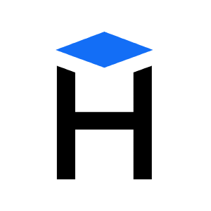
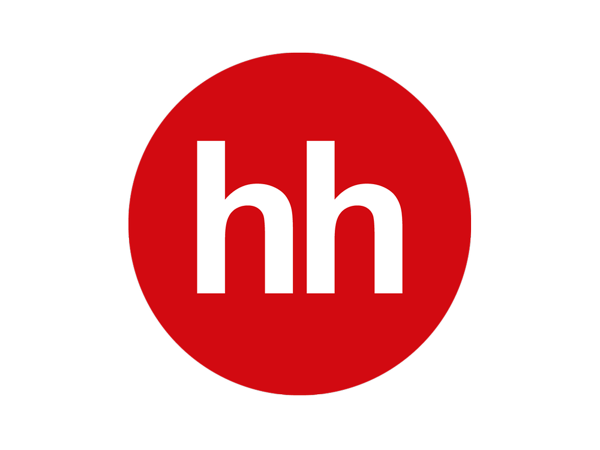
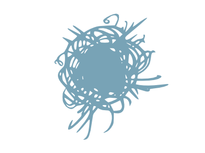
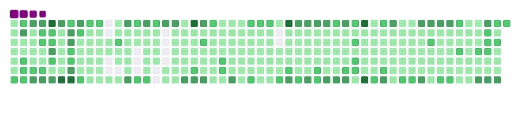

<!--
**IgorGakhov/IgorGakhov** is a ✨ _special_ ✨ repository because its `README.md` (this file) appears on your GitHub profile.

Here are some ideas to get you started:

- 🔭 I’m currently working on ...
- 🌱 I’m currently learning ...
- 👯 I’m looking to collaborate on ...
- 🤔 I’m looking for help with ...
- 💬 Ask me about ...
- 📫 How to reach me: ...
- 😄 Pronouns: ...
- ⚡ Fun fact: ...
-->

<!-- Banner -->

<!-- Language selection -->

    
<b>🇬🇧 English</b>

    <b><a href="locale/ru/README.md">🇷🇺 Russian</a></b>
  

<!-- Title -->
<h1 align="center">Hi, guys! </h1>

<b>Welcome to my page!</b> <i>I'm Igor, currently learning Python and dreaming of becoming a strong developer.</i>

<!-- CV & Socials -->

  <b>My CV:</b>
   
  <kbd>
    <!--  -->
    
    
  </kbd>
   
  <b>My contacts:</b>
   
    
    
    <a href="https://vk.com/igor_gakhov">
      
     
    </a>
    
    
    
  
<i>💬 If you have any question/feedback, please do not hesitate to reach out to me! Preferred contact method is Email or Telegram.</i>

 

<!-- Outer collapsible -->  

   
<b>&#128073 Expand for more!</b>

  
    

  <!-- About Section -->
  

    
<b>&#128100 About</b>

      

        
      

        
  <blockquote>

  In programming, I am motivated by the ability to create something new, solve interesting problems, as well as unlimited scope for personal development and career growth, because I don’t like to stagnate and turn sour otherwise.
  
  Now Backend and deepening in this direction are interesting. The choice was not made by chance: Backend is the “brain” of the application, and as a person of a mathematical mindset (in my school years I was fond of mathematics, participated in olympiads), I just like working with data, systematizing processes and building architecture. In the future plans - the study of new languages ​​and tools, including Frontend-technologies.

  </blockquote>
    
  ----

  

   

  <!-- Tech Stack Section -->
  

    
<b>🛠️ Tech Stack</b>

   

  <table>
    <!-- https://simpleicons.org/ -->
    <tr>
      <td>Category</td>
      <td>Technologies</td>
    </tr>
    <tr>
      <td>Languages</td>
      <td>
        
        
      </td>
    </tr>
    <tr>
      <td>Frameworkes</td>
      <td>
        
        
        
      </td>
    </tr>
    <tr>
      <td>Managers</td>
      <td>
        
        
        
      </td>
    </tr>
    <tr>
      <td>Tests</td>
      <td>
        
        
      </td>
    </tr>
    <tr>
      <td>Databases & ORMs</td>
      <td>
        
        
        
        
      </td>
    </tr>
    <tr>
      <td>DevOps</td>
      <td>
        
      </td>
    </tr>
    <tr>
      <td>Cloud</td>
      <td>
        
      </td>
    </tr>
    <tr>
      <td>Enviroment & Tools</td>
      <td>
        
        
        
        
        
        
        
        
        
        
        
      </td>
    </tr>
    <tr>
      <td>Web</td>
      <td>
        
        
        
        
        
      </td>
    </tr>
  </table>

  <!-- See **[➡️ Full Tech Stack](pages/TECH-STACK.md)**, for a list of projects using each of the above technologies. -->

  ----

  

   

  <!-- Portfolio Section -->
  <!-- 

    
<b>🧑‍💻 Portfolio</b>

   

  ----

  

    -->

  <!-- Metrics Section -->
  

    
<b>📊 Metrics</b>

   

  
  
  

  ----

  

   

  <!-- Recent Activity Section -->
  

    
<b>⚡ Recent Activity</b>

   

  
<b><i>Recent activity until today:</i></b>

  <!--RECENT_ACTIVITY:start-->
  <!--RECENT_ACTIVITY:end-->

  <!--RECENT_ACTIVITY:last_update-->
Last Updated: Friday, January 31st, 2025, 1:12:28 AM (GMT)
  <!--RECENT_ACTIVITY:last_update_end-->

  ➡️  **[More Activity](pages/RECENT-ACTIVITY.md)**

  ----

  

   

   

<!-- Snake Section -->   

  

